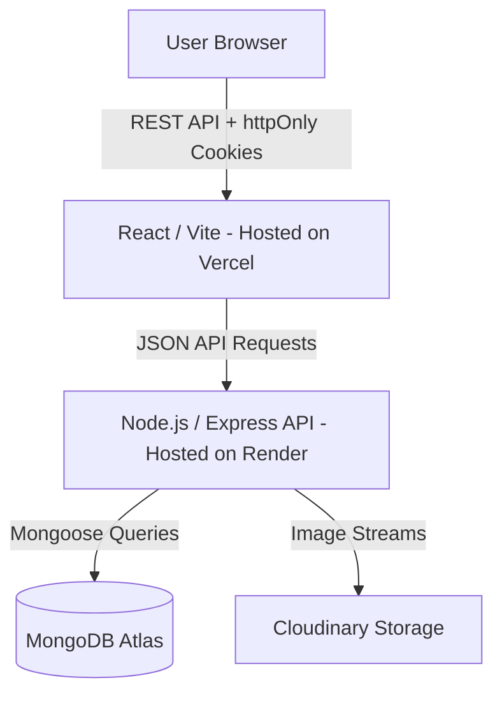

# Clothing Exchange & Swap Marketplace

A sustainable web platform that facilitates direct, item-for-item clothing exchanges without monetary transactions.

**Live Demo:** [https://clothing-exchange-marketplace.vercel.app/](https://clothing-exchange-marketplace.vercel.app/)  
**GitHub Repository:** [https://github.com/Paulson-2004/clothing-exchange-marketplace](https://github.com/Paulson-2004/clothing-exchange-marketplace)  
**Major Technical Value:** A fully verified 8-phase production application featuring deterministic swap valuation, algorithmic location-based matching, and a highly resilient state machine for conflict-free direct exchanges.

## Overview
The Clothing Exchange & Swap Marketplace is a platform designed to promote sustainable fashion by enabling users to trade clothing they no longer wear. Rather than relying on traditional e-commerce models where items are bought and sold with money, this application strictly focuses on direct item-for-item swaps, powered by algorithmic location matching and deterministic value estimation.

## Problem
The fashion industry generates significant waste, and individuals often have wearable clothing sitting unused in their wardrobes. While conventional marketplaces allow selling, they often require managing monetary transactions, payments, and shipping. Finding suitable exchange partners for direct swaps is challenging due to geographic barriers, uncertainty regarding the fairness of trades, and the lack of a structured platform specifically dedicated to item-for-item exchanges.

## Key Features
- **Authentication:** Secure user registration, login, and authorization.
- **User Profiles and Location:** Comprehensive user profiles with granular city/state/country location settings.
- **Clothing Listings:** Full CRUD operations for clothing items.
- **Search/Filtering:** Browse the marketplace with case-insensitive filtering by category, condition, size, and explicit city/state location.
- **Image Uploads:** Support for uploading multiple high-resolution images.
- **Swap Requests:** Propose trades offering your own listings in exchange for desired items.
- **Swap Lifecycle:** Strict state machine managing requests from pending to accepted or completed.
- **Chat/Negotiation:** Contextual, swap-linked direct messaging.
- **Value Comparison:** Algorithmic estimation and percentage-based fairness classification for trades.
- **Location-Based Matching:** Automatic suggestion of geographically close and value-compatible items.
- **Admin Dashboard/Moderation:** System-wide metrics, user role management, and listing moderation.

## How It Works
Register → Create profile & listings → Browse marketplace → Find compatible/nearby items → Compare values → Request swap → Negotiate via chat → Accept request → Complete swap → View in swap history.

## Screenshots

*(Note: Documentation screenshots will be stored in `docs/assets/`. You can add them here to demonstrate the UI.)*

- **Marketplace/Home page:** `<!-- Add screenshot here:  -->`
- **Item Details + Nearby Swap Matches:** `<!-- Add screenshot here:  -->`
- **Chat Interface:** `<!-- Add screenshot here:  -->`
- **Admin Dashboard:** `<!-- Add screenshot here:  -->`

## Technology Stack

**Frontend**
- React (18.3.1)
- React Router (7.18.3)
- Vite (5.3.4)
- Axios

**Backend**
- Node.js
- Express (4.19.2)

**Database**
- MongoDB (via Mongoose 8.5.0)

**Authentication/Security**
- JSON Web Tokens (jsonwebtoken)
- bcryptjs
- cookie-parser
- cors

**Cloud/Deployment**
- Cloudinary (Image Hosting)
- Vercel (Frontend Hosting)
- Render (Backend Hosting)
- MongoDB Atlas (Cloud Database)

**Testing**
- Native Node.js scripts (Integration/E2E API Tests)

## Architecture
The application uses a standard decoupled client-server architecture:



## Core Modules

### Authentication
Secure identity management utilizing bcrypt for password hashing and JWTs delivered via httpOnly cookies.

### Marketplace
The central hub for browsing active clothing listings. Includes indexing for search and rigorous filtering.

### Swap System
A robust state machine governing how trades are proposed and confirmed. Prevents duplicate requests and automatically handles conflicting states when a swap is accepted.

### Chat
Provides a dedicated messaging thread tied explicitly to an active swap request, ensuring participants can securely negotiate details.

### Value Comparator
Calculates an estimated swap value for listings based on brand, category, and condition. It computes the percentage difference between two items and categorizes the trade fairness as a `Close Match`, `Moderate Difference`, or `Large Difference`.

### Location Matching
Evaluates user locations to suggest nearby items (exact city/state, or same state). It integrates with the value comparator to exclude highly incompatible items from automated suggestions.

### Admin Panel
Role-based access control grants administrators a specialized dashboard to view aggregate statistics, manage user roles (with self-demotion protections), and moderate (delete) inappropriate listings.

## Swap Lifecycle
The lifecycle follows a strictly enforced state flow:
- `pending` → `accepted` → `completed`

Alternative resolutions:
- `pending` → `rejected`
- `pending` → `cancelled`

**Rules:** 
Only the listing owner can propose an item. Accepting a swap safely locks the availability of both items, automatically rejecting any other pending requests involving either listing.

## Location & Value Matching
The matching algorithm works hierarchically without relying on external geocoding:
- **City/State Matching:** Exact matches on both city and state are prioritized.
- **Same-State Matching:** Matches within the same state provide secondary suggestions.
- **Availability Filtering:** Only `available` items are considered.
- **Own-Listing Exclusion:** A user's own items are explicitly excluded from their suggestions.
- **Value Compatibility:** Potential matches are evaluated, and "Large Difference" value discrepancies are excluded.
- **Match Scoring:** Matches are assigned a deterministic score summing location proximity and value compatibility, yielding sorted, relevant recommendations.

## Security
- **Password Hashing:** Implemented using `bcryptjs`.
- **Authentication:** JWT stored in secure `httpOnly` cookies.
- **Secure Production Cookies:** Automatically applies `secure: true` and `sameSite: 'none'` in production to support cross-domain Vercel/Render authentication.
- **CORS Configuration:** Explicitly configured to allow credentials from the designated frontend origin.
- **Protected Routes:** Express middleware `protect` validates the JWT on all sensitive endpoints.
- **Frontend Route Protection:** React Router gating using a `ProtectedRoute` component.
- **Ownership Enforcement:** Backend explicitly verifies that users only mutate documents (listings/swaps) they own.
- **Admin RBAC:** `requireAdmin` middleware limits access to moderation and analytics endpoints.
- **Secret Management:** Strict isolation of secrets using `.env` variables; no hardcoded keys in the repository.
- **Sanitized Git History:** The repository history was meticulously scrubbed to ensure no historical credentials remain accessible.

## Testing
- **Backend automated tests:** 173/173 tests passing (100% test pass rate).
- **Frontend production build:** Passing with zero compilation errors.
- **Production manual QA:** All 8 major functional areas successfully verified on live deployed architecture.

## Local Development

1. **Clone repository:**
   ```bash
   git clone https://github.com/Paulson-2004/clothing-exchange-marketplace.git
   cd clothing-exchange-marketplace
   ```

2. **Install backend dependencies:**
   ```bash
   cd backend
   npm install
   ```

3. **Install frontend dependencies:**
   ```bash
   cd ../frontend
   npm install
   ```

4. **Configure environment variables:**
   - In `backend/`, copy `.env.example` to `.env` and fill in your local values.
   - In `frontend/`, copy `.env.example` to `.env` (usually `VITE_API_BASE_URL=http://localhost:5000/api`).

5. **Start backend:**
   ```bash
   cd backend
   npm run dev
   ```

6. **Start frontend:**
   ```bash
   cd frontend
   npm run dev
   ```

7. **Run tests (from the backend directory while the server is running):**
   ```bash
   cd backend
   npm run test:phase4
   npm run test:phase5
   npm run test:phase6
   npm run test:phase7
   npm run test:phase8
   npm run test:profile-location
   ```

8. **Build frontend:**
   ```bash
   cd frontend
   npm run build
   ```

## Environment Variables
The application relies on the following environment variable names (do not commit real values):

**Backend (`backend/.env`)**
- `NODE_ENV` (e.g., `development` or `production`)
- `PORT` (e.g., `5000`)
- `MONGO_URI` (MongoDB connection string)
- `JWT_SECRET` (Random string for signing tokens)
- `CLIENT_URL` (e.g., `http://localhost:5173`)
- `CLOUDINARY_CLOUD_NAME`
- `CLOUDINARY_API_KEY`
- `CLOUDINARY_API_SECRET`
- `ADMIN_EMAIL` (For initial seeding)
- `ADMIN_PASSWORD` (For initial seeding)

**Frontend (`frontend/.env`)**
- `VITE_API_BASE_URL` (e.g., `http://localhost:5000/api`)

## Deployment
The application is fully deployed to production:
- **Vercel frontend:** SPA routing handled via `vercel.json`.
- **Render backend:** Express API running as a Web Service.
- **MongoDB Atlas:** Managed cloud database.
- **Cloudinary:** Used for robust image storage and delivery.

## Project Structure
```text
clothing-exchange-marketplace/
├── backend/
│   ├── src/
│   │   ├── controllers/
│   │   ├── middleware/
│   │   ├── models/
│   │   ├── routes/
│   │   ├── scripts/
│   │   └── utils/
│   ├── tests/
│   └── server.js
├── frontend/
│   ├── src/
│   │   ├── api/
│   │   ├── components/
│   │   ├── context/
│   │   ├── pages/
│   │   └── utils/
│   └── vite.config.js
└── docs/
    ├── PRD.md
    ├── architecture.md
    ├── current-state.md
    ├── implementation-plan.md
    ├── PROJECT_REPORT.md
    └── requirements.md
```

## Documentation
Additional detailed documentation can be found in the `docs/` directory:
- [Product Requirements Document (PRD)](docs/PRD.md)
- [Architecture & Database Design](docs/architecture.md)
- [Original Requirements](docs/requirements.md)
- [Implementation Plan](docs/implementation-plan.md)
- [Project Report](docs/PROJECT_REPORT.md)

## Limitations
- **Messaging:** Relies on a REST polling interval rather than true WebSocket connections.
- **Monetary Transactions:** The platform strictly enforces direct item-for-item trades; there is no monetary/payment system.
- **Mobile Experience:** The application is a responsive web application without a native mobile app wrapper or dedicated hamburger-style mobile navigation.
- **Swap Actions:** Confirming or rejecting swaps is handled centrally through the Swap Requests dashboard rather than via inline controls within the chat interface.
- **Accessibility:** A formal WCAG accessibility audit has not been conducted.

## Future Enhancements
- Richer mobile navigation.
- Inline swap action controls integrated directly into the chat stream.
- WebSocket-based realtime messaging.
- Courier/shipping integration to support non-local exchanges.
- Expanded platform analytics.
- Stronger accessibility auditing.

## Roadmap
1. Project Scaffolding — **COMPLETE**
2. Authentication — **COMPLETE**
3. Clothing Listings / Marketplace — **COMPLETE**
4. Swap Request System — **COMPLETE**
5. Chat & Negotiation — **COMPLETE**
6. Swap Value Comparator — **COMPLETE**
7. Location-Based Matching — **COMPLETE**
8. Admin Panel — **COMPLETE**

## Project Status
The Clothing Exchange & Swap Marketplace is **feature-complete**, successfully deployed to production, and manually verified. All functionality specified in the authoritative 8-phase roadmap is fully implemented and backed by a comprehensive passing test suite.

## License
No license has currently been specified for this repository.
