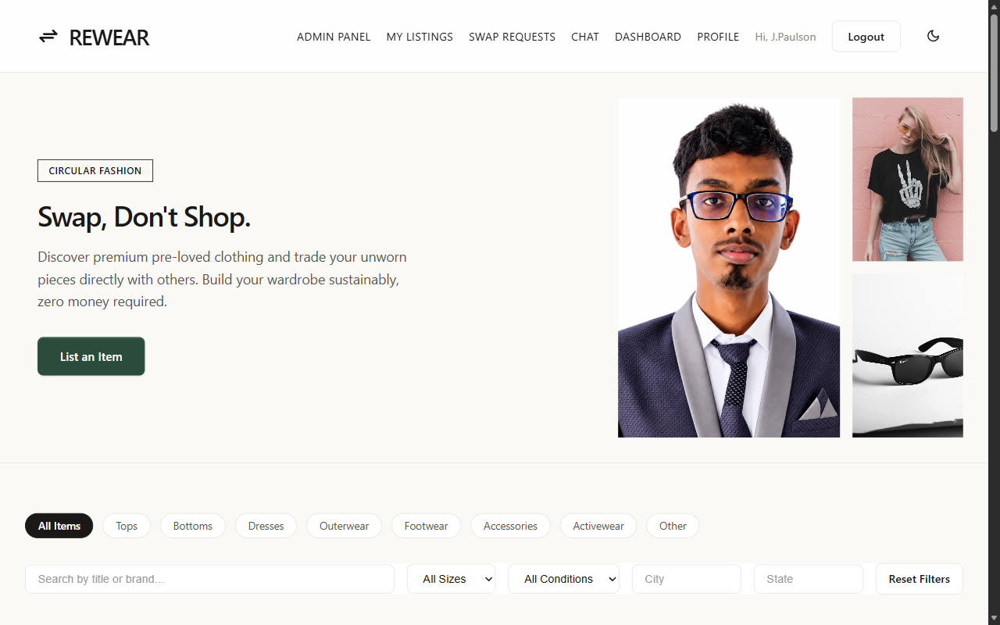
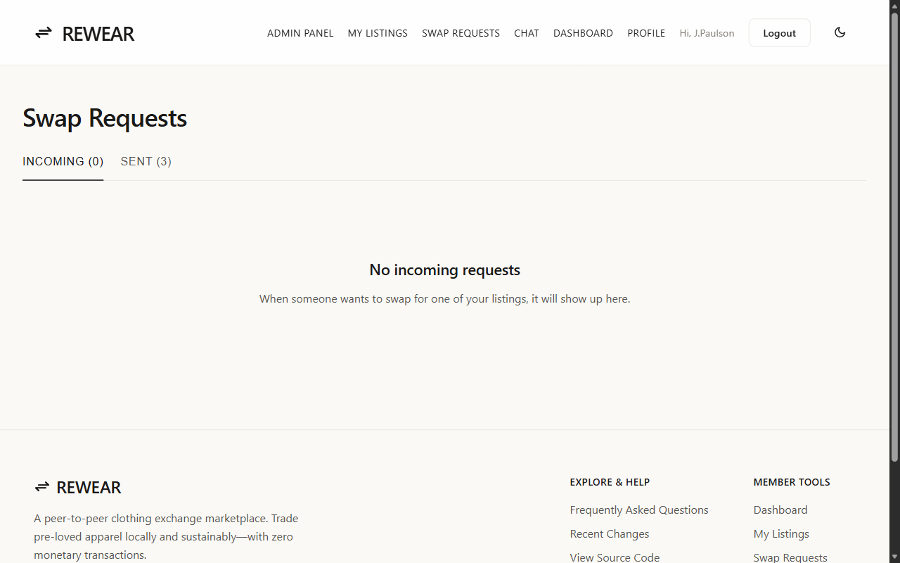
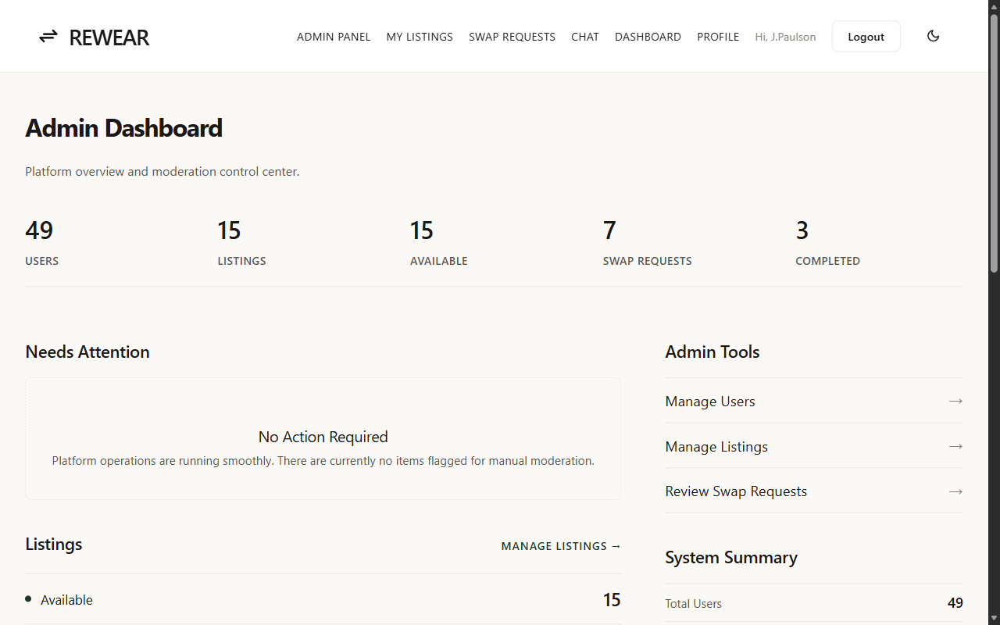

# ReWear

ReWear is a peer-to-peer clothing exchange and swap marketplace. It allows users to discover premium pre-loved clothing, trade unworn pieces directly with others, and build their wardrobes sustainably—zero money required.

## Live Demo

- **Frontend:** https://rewear-swap.vercel.app/
- **Backend API:** https://clothing-exchange-marketplace.onrender.com

## Screenshots

### Marketplace


### Swap & Negotiation


### Admin Dashboard


## About

ReWear replaces traditional e-commerce monetary transactions with a direct item-for-item swapping mechanism. Users can list items with estimated values, browse the marketplace, send swap requests proposing their own items in exchange, and negotiate via chat. The platform also includes comprehensive admin tools for moderation.

## Features

- **Item-for-Item Swapping**: Propose trades using your own listed inventory instead of cash.
- **Chat-based Negotiation**: Integrated polling-based chat for discussing swap details.
- **Value Matching**: Automated warnings if proposed swaps have significant value disparities.
- **Location-based Filtering**: Find items nearby using city/state text searches.
- **Admin Dashboard**: Comprehensive moderation tools for users, listings, and swap requests.
- **Dark Mode Support**: Full light and dark theme support via CSS variables.

## Tech Stack

- **Frontend**: React, React Router v6, Vite
- **Backend**: Node.js, Express
- **Database**: MongoDB (via Mongoose)
- **Authentication**: JWT (HTTP-only cookies)
- **Image Storage**: Cloudinary (via Multer)

## Project Structure

```text
frontend/         # React SPA (Vite)
backend/          # Node.js Express API
docs/             # Project Documentation
```

## Quick Setup

1. **Clone and Install**
   Install dependencies for the root, frontend, and backend:
```bash
   npm install
   cd frontend && npm install
   cd ../backend && npm install
   ```

2. **Environment Variables**
   Create a .env file in the `backend/` directory:
   ```env
   NODE_ENV=development
   PORT=5001
   MONGO_URI=mongodb://127.0.0.1:27017/rewear
   JWT_SECRET=your_jwt_secret
   CLOUDINARY_CLOUD_NAME=your_name
   CLOUDINARY_API_KEY=your_key
   CLOUDINARY_API_SECRET=your_secret
   ```

3. **Start Development Servers**
   From the project root:
```bash
   npm run dev
   ```
   This uses concurrently to run both the Vite frontend (port 5173) and the Express backend (port 5001).

## Documentation

Detailed documentation can be found in the /docs directory:

- [Setup Guide](docs/setup.md)
- [Architecture](docs/architecture.md)
- [Features](docs/features.md)
- [API Reference](docs/api.md)
- [Database Schema](docs/database.md)
- [Development](docs/development.md)
- [Deployment](docs/deployment.md)
- [FAQ](docs/faq.md)
- [Recent Changes](docs/recent-changes.md)

